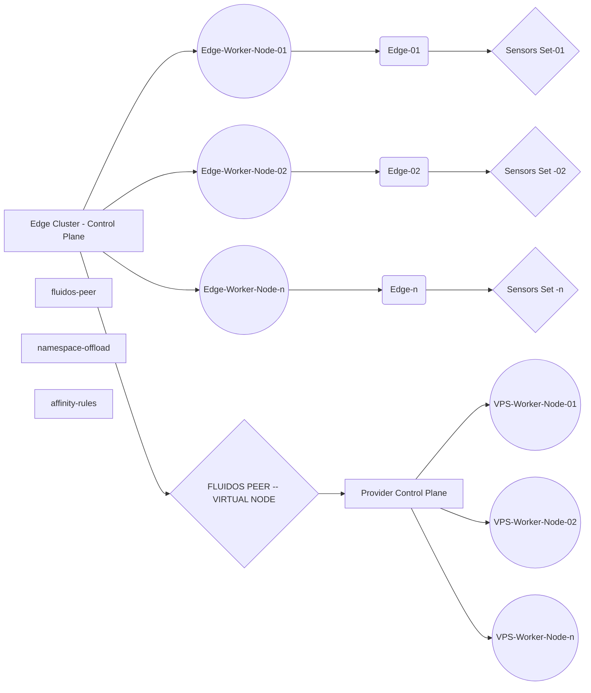

# FLUIDOMOS Infrastructure 

```mermaid
graph LR
ecp01[Edge Cluseter - Control Plane] --> ecp01w01((Edge-Worker-Node-01))--> ecp01w01d01(Edge-01)--> ecp01w01d01s01{Sensors Set-01}
ecp01[Edge Cluster - Control Plane] --> ecp01w02((Edge-Worker-Node-02))--> ecp01w02d02(Edge-02)--> ecp01w02d02s02{Sensors Set -02}
ecp01[Edge Cluster - Control Plane] --> ecp01w0N((Edge-Worker-Node-n))--> ecp01w0nd0n(Edge-n)--> ecp01w0nd0ns0n{Sensors Set -n}

fluidos-peer
namespace-offload
affinity-rules

ecp01-->p{FLUIDOS PEER -- VIRTUAL NODE}-->pcp

pcp[Provider Control Plane] --> pw01((VPS-Worker-Node-01))
pcp[Provider Control Plane] --> pw02((VPS-Worker-Node-02))
pcp[Provider Control Plane] --> pw0n((VPS-Worker-Node-n))

```
