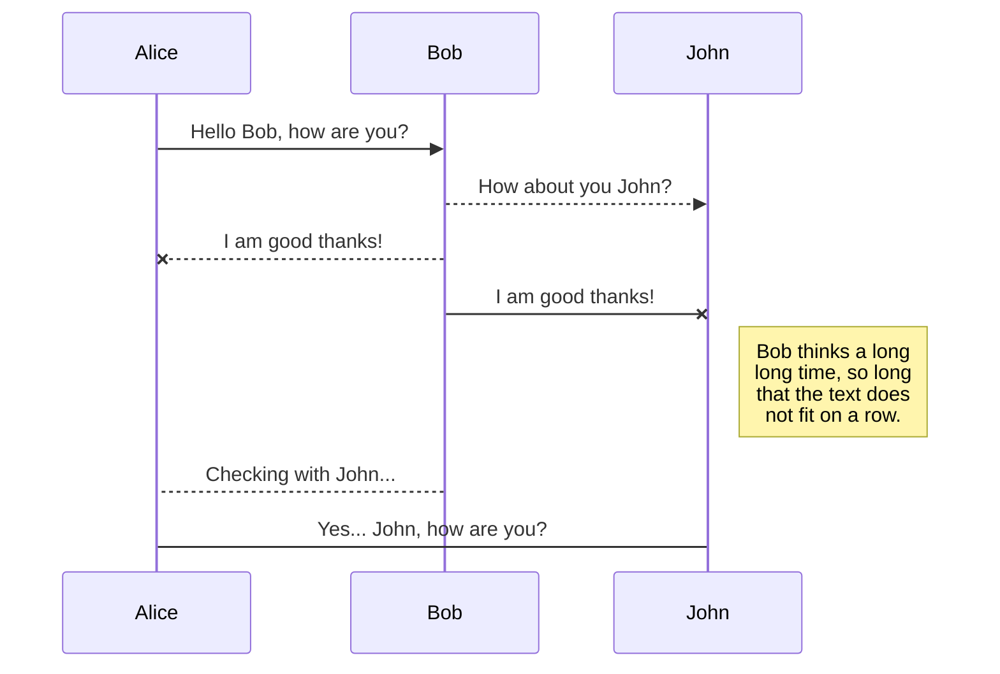
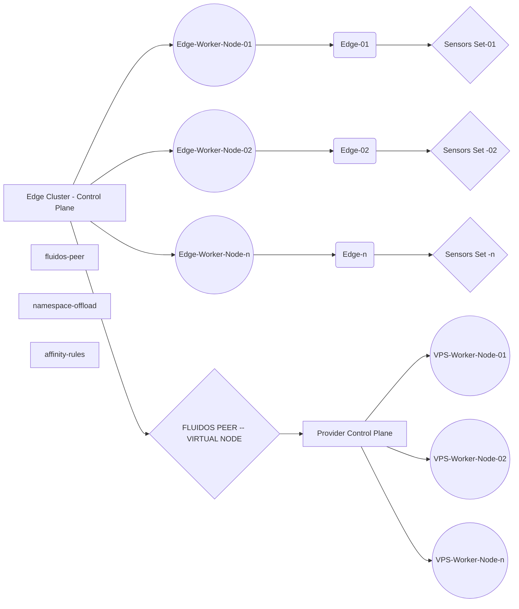

**Fluids installation procedure definitive system**

The final installation procedure was created with 4 nodes (2 masters and 2 Kubernetes workers) without using docker, on 2 Kubernetes clusters identified as follows:

*   91.121.49.150, 10.255.0.131 **consumer1-fluidomos** (OS: Debian 12.6 – RAM: 32GB – 8 CPU – Disk: 20GB – Virtual machine amd64), with respective worker node: 10.255.0.132 **cworker1-fluidomos** (OS: Debian 12.6 – RAM: 16GB – 8 CPU – Disk: 15GB – Virtual machine amd64)
*   10.255.36.163 **provider1-fluidomos** (OS: Debian 12.6 – RAM: 32GB – 8 CPU – Disk: 20GB – Virtual machine amd64), with respective worker node: 10.225.36.164 **pworker1-fluidomos** (OS: Debian 12.6 – RAM: 32GB – 8 CPU – Disk: 20GB – Virtual machine amd64)

The basic products (helm, k3s, liqo) were installed on the master nodes ( **consumer1-fluidomos** and **provider1-fluidomos** ) and exclusively k3s on the worker nodes ( **cworker1-fluidomos** and **pworker1-fluidomos** ) in the sequences indicated below.

## Steps

### Installing Helm (on both master nodes from root)

apt-get update && apt-get install apt-transport-https gpg git curl unzip

curl https://baltocdn.com/helm/signing.asc | gpg --dearmor | tee /usr/share/keyrings/helm.gpg > /dev/null

echo "deb \[arch=$(dpkg --print-architecture) signed-by=/usr/share/keyrings/helm.gpg\] https://baltocdn.com/helm/stable/debian/ all main" | tee /etc/apt/sources.list.d/helm-stable-debian.list

apt get update

apt-get install helm

### Installing K3s to version v1.24.17+k3s1 on master and worker

About consumer1-fluidomos

curl -sfL https://get.k3s.io | K3S\_NODE\_NAME=consumer1-fluidomos INSTALL\_K3S\_VERSION=v1.24.17+k3s1 sh -s - server --cluster-init

cat /var/lib/rancher/k3s/server/node-token  
K10671656dd98b4604a78fbea80ccbd5a7ca4695fe2372b70b98bb10dcf4d5f4758::server:dc37106222de489c00e4457d73e94034

About cworker1-fluidomos

curl -sfL https://get.k3s.io | INSTALL\_K3S\_EXEC="agent" K3S\_URL=https://10.255.0.131:6443 K3S\_NODE\_NAME=cworker1-fluidomos INSTALL\_K3S\_VERSION=v1.24.17+k3s1 K3S\_TOKEN=K10671656dd98b4604a78fbea80ccbd5a7ca4695fe2372b70b98bb10dcf4d5f4758::server:dc37106222de489c00e4457d73e94034 sh -

About provider1-fluidomos

curl -sfL https://get.k3s.io | K3S\_NODE\_NAME=provider1-fluidomos INSTALL\_K3S\_VERSION=v1.24.17+k3s1 sh -s - server –cluster-init

cat /var/lib/rancher/k3s/server/node-token  
K102d9ec76ba1f35bbc9c763739caa01fb6b78b25f7f3af42cbfa57e9aad4780d17::server:b2c73c0e85cc48a8dafe8f8a226252f0

About pworker1-fluidomos

curl -sfL https://get.k3s.io | INSTALL\_K3S\_EXEC="agent" K3S\_URL=https://10.255.36.163:6443 K3S\_NODE\_NAME=pworker1-fluidomos INSTALL\_K3S\_VERSION=v1.24.17+k3s1 K3S\_TOKEN=K102d9ec76ba1f35bbc9c763739caa01fb6b78b25f7f3af42cbfa57e9aad4780d17::server:b2c73c0e85cc48a8dafe8f8a226252f0 sh -

### Installing liqoctl CLI for amd64 architecture on both masters

cd /tmp

curl --fail -LS "https://github.com/liqotech/liqo/releases/download/v0.10.3/liqoctl-linux-amd64.tar.gz" | tar -xz

install -o root -g root -m 0755 liqoctl /usr/local/bin/liqoctl

rm liquid

## FLUIDS Setup

Copying fluidos package v.0.0.5 to both master nodes

cd /root  
wget [https://github.com/fluidos-project/node/archive/refs/tags/v0.0.5.zip](https://github.com/fluidos-project/node/archive/refs/tags/v0.0.5.zip)  
unzip v0.0.5.zip  
mv node-0.0.5 node

on the consumer1-fluidomos node the label assignment commands to the consumer1-fluidomos and cworker1-fluidomos nodes are executed

kubectl label nodes consumer1-fluidomos node-role.fluidos.eu/resources=true node-role.fluidos.eu/worker=true  
kubectl label nodes cworker1-fluidomos node-role.fluidos.eu/resources=true node-role.fluidos .eu/worker=true

on the provider1-fluidomos node the label assignment commands to the provider1-fluidomos and pworker1-fluidomos nodes are executed

kubectl label nodes provider1-fluidomos node-role.fluidos.eu/resources=true node-role.fluidos.eu/worker=true  
kubectl label nodes pworker1-fluidomos node-role.fluidos.eu/resources=true node-role.fluidos .eu/worker=true

The following commands are executed on consumer1-fluidomos and provider1-fluidomos

cd node/testbed/kind

kubectl apply -f ../../deployments/node/crds

export KUBECONFIG="/etc/rancher/k3s/k3s.yaml"

helm repo add fluids https://fluidos-project.github.io/node/

(NOTE snapshot reference: preconf\_post\_rancher)

Then, on the consumer1-fluidomos first helm is executed and then liqoctl

_cd /root/node/testbed/kind_

export KUBECONFIG="/etc/rancher/k3s/k3s.yaml"

helm install node fluids/node -n fluids \\

\--create-namespace -f consumer/values.yaml \\

\--set networkManager.configMaps.nodeIdentity.ip="91.121.49.150:30000" \\

\--set networkManager.configMaps.providers.local="10.255.36.163:30001" \\

\--version 0.0.5

liqoctl install k3s --cluster-name fluids-consumer \\

\--version v0.10.3 \\

\--set controllerManager.config.resourcePluginAddress=node-rear-controller-grpc.fluidos:2710 \\

\--set controllerManager.config.enableResourceEnforcement=true

NOTE: The cluster-name fluidos-consumer is binding, it cannot be changed

while on provider1-fluidomos first helm is executed and then liqoctl

_cd /root/node/testbed/kind_

export KUBECONFIG="/etc/rancher/k3s/k3s.yaml"

helm install node fluids/node -n fluids \\

\--create-namespace -f provider/values.yaml \\

\--set networkManager.configMaps.nodeIdentity.ip="10.255.36.163:30001" \\

\--set networkManager.configMaps.providers.local="91.121.49.150:30000" \\

\--version 0.0.5

liqoctl install k3s --cluster-name fluids-provider \\

\--version v0.10.3 \\

\--set controllerManager.config.resourcePluginAddress=node-rear-controller-grpc.fluidos:2710 \\

\--set controllerManager.config.enableResourceEnforcement=true

Check the installation status of fluids and liquids

kubectl get pods -A

liquid status

kubectl get flavors.nodecore.fluidos.eu -n fluids

(NOTE snapshot reference: pre-solver)

Next to use the resources, run the following commands on consumer1-fluidomos

nano node/deployments/node/samples/solver.yaml

Changed parameters:

rangeSelector:

minCpu: "6000m"

minMemory: "24Gi"

minPods: "100"

kubectl apply -f node/deployments/node/samples/solver.yaml

kubectl get solver -n fluids

It was found that at the end a one-way peering from consumer to provider is established

on consumer:

root@consumer:~# export KUBECONFIG=/etc/rancher/k3s/k3s.yaml liqoctl status peer

┌─ Peered Cluster Information ────────────────────────────── ──────────────────────────────┐

| fluids-provider - 32e707ce-70eb-49af-a288-74c079f91e0e |

| Type: OutOfBand |

| Direction |

| Outgoing: Established |

| Incoming: None |

| Authentication |

| Status: Established |

| Network |

| Status: Established |

| Network connection |

| Status: Connected |

| Latency: 25ms |

| IP Gateways |

| Local: 91.121.49.150:32645 |

| Remote: 10.255.36.163:32767 |

| API Server |

| Status: Established |

| Resources |

| Total acquired - resources offered by "fluidos-provider" to "fluidos-consumer" |

| cpu: 6000m |

| memory: 25.17GiB |

| pods: 100 |

| ephemeral-storage: 0.00GiB |

└───────────────────── ─────────────────────── ─────────────────────── ──────────────────────┘

and on provider

root@provider:~# export KUBECONFIG=/etc/rancher/k3s/k3s.yaml liqoctl status peer

┌─ Peered Cluster Information ───────────────────────────── ─────────────────────────────┐

| fluids-consumer - f0403bd6-be56-425a-a8d4-03eebdad982b |

| Type: OutOfBand |

| Direction |

| Outgoing: None |

| Incoming: Established |

| Authentication |

| Status: Established |

| Network |

| Status: Established |

| Network connection |

| Status: Connected |

| Latency: 24ms |

| IP Gateways |

| Local: 10.255.36.163:32767 |

| Remote: 91.121.49.150:32645 |

| API Server |

| Status: Established |

| Resources |

| Total shared - resources offered by "fluidos-provider" to "fluidos-consumer" |

| cpu: 6000m |

| memory: 25.17GiB |

| pods: 100 |

| ephemeral-storage: 0.00GiB |

└───────────────────── ────────────────────── ────────────────────── ──────────────────────┘
# Markdown extensions

StackEdit extends the standard Markdown syntax by adding extra **Markdown extensions**, providing you with some nice features.

> **ProTip:** You can disable any **Markdown extension** in the **File properties** dialog.

## SmartyPants

SmartyPants converts ASCII punctuation characters into "smart" typographic punctuation HTML entities. For example:

|                |ASCII                          |HTML                         |
|----------------|-------------------------------|-----------------------------|
|Single backticks|`'Isn't this fun?'`            |'Isn't this fun?'            |
|Quotes          |`"Isn't this fun?"`            |"Isn't this fun?"            |
|Dashes          |`-- is en-dash, --- is em-dash`|-- is en-dash, --- is em-dash|

## KaTeX

You can render LaTeX mathematical expressions using [KaTeX](https://khan.github.io/KaTeX/):

The *Gamma function* satisfying $\Gamma(n) = (n-1)!\quad\forall n\in\mathbb N$ is via the Euler integral

$$
\Gamma(z) = \int_0^\infty t^{z-1}e^{-t}dt\,.
$$

> You can find more information about **LaTeX** mathematical expressions [here](http://meta.math.stackexchange.com/questions/5020/mathjax-basic-tutorial-and-quick-reference).

## UML diagrams

You can render UML diagrams using [Mermaid](https://mermaidjs.github.io/). For example, this will produce a sequence diagram:

And this will produce a flow chart:

